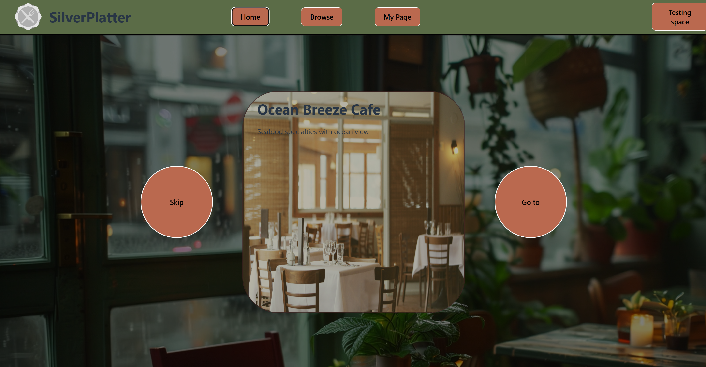

# Silver Platter
A unified web application for restaurant discovery and management.



The platform enables restaurants to host and manage their menus, allows customers to browse offerings and book tables seamlessly, and provides AI-driven recommendations tailored to individual customer preferences. Additionally, restaurants are offered extensive customization options to personalize their profiles and menus, helping them stand out from competitors within the platform.

## Table of Contents

- [Installation](#installation)
- [Usage](#usage)
- [Architecture](#architecture)
- [License](#license)

## Installation

Provide step-by-step instructions on how to install and set up your project.

### Clone the repository

```
git clone https://github.com/chrnas/silver-platter.git
```
or with ssh
```
git clone git@github.com:chrnas/silver-platter.git
```

### Install dependencies
Make sure the following dependencies are installed:
- .NET SDK 8
- node.js
- mysql

### Create and seed database
Create a database using  `SilverPlatter.Data/schema.sql` script. On windows, an example of doing this is using **Command Promt (CMD)**
```
mysql -u <username> -p < schema.sql
```

Seeding database with sample data can be done using the  `SilverPlatter.Data/seed.sql` script. Or filling database with other data. On windows, an example of doing this is using **Command Promt (CMD)**
```
mysql -u <username> -p < seed.sql
```

### Add Connection String and Development Settings

Copy `SilverPlatter.Server/appsettings.json` and create a  
`SilverPlatter.Server/appsettings.Development.json` file.

Update the connection string and replace any other environment-specific
configuration values as needed.

### Run application
Enter Server folder
```
cd SilverPlatter.Server
```
Run application
```
dotnet run
```

## Usage

After starting the application, access the web interface through your browser.  

- **Home Page:** Displays AI-driven recommendations tailored for the user.  
- **Browse Page:** Allows customers to filter and search for restaurants.  
- **Profile Page:** Enables users to adjust their settings and preferences.  
- **Restaurant Page:**  
  - For customers: View restaurant menus and book tables.  
  - For restaurants: Create and customize profiles, manage menus, and handle table bookings.

## Architecture

The application is structured as a web-based system with a server-side backend with ASP.NET Core (.NET), a client-side frontend using React, and a MySQL database.  

## License
This project does not currently have a license. See LICENSE file for details if added.